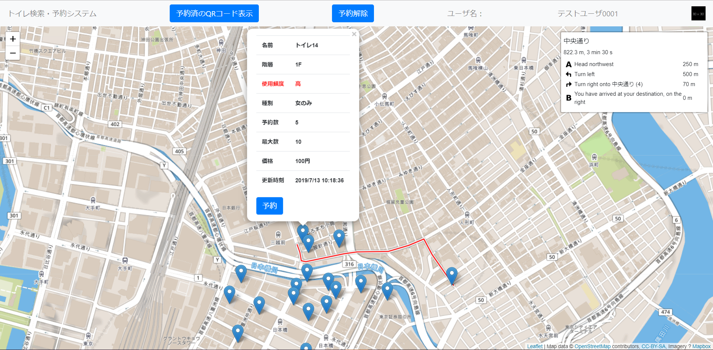

# sse2019-group3

## トイレ検索・予約システム

## できること
1. 現在位置から近くのトイレを探すことができます
    1. トイレの位置、使用頻度、価格などを表示できます
    1. 使用頻度は10秒単位で更新されます
1. トイレを予約することができます
    -  デモ版は最大1件です
    -  デモ版は全ユーザ共通IDです
1. 予約先のトイレで使用するQRコードを発行できます
1. 予約したトイレまでの経路を検索できます
    -  デモ版は地図サーバを間借りしている都合上、正常に経路が表示されないことがあります

## デモサイトへのアクセス(説明すっ飛ばし版)
1. [https://13.112.165.3/](https://13.112.165.3/) にアクセスする

1. 「このサイトは安全ではありません」とエラーが出るため、下記の設定を追加する  
(このあと、ページに大量の文字列が出ますがデモには関係ないため無視してください)

    -  Chromeの場合(Windows版, Android版で同様)
        - 「詳細設定」→「このサイトを信頼する」
    -  Edgeの場合
        - 「詳細」→「Webページへ移動(非推奨)」  
    -  Safariの場合
        -  上記と似たような設定を追加

1. [https://smart-se.github.io/sse2019-group3/](https://smart-se.github.io/sse2019-group3/)にアクセスする

## デモサイトへのアクセス(説明あり版)
　デモサイトでは、データベースサーバへhttps通信を行っていますが、いわゆるオレオレ証明書であるため  
　デフォルトの設定ではアクセスすることができません。  
　そのままデモサイトに接続しても、正常に実行することができません。  
　そこで、SSL証明書のエラーを無視する設定を追加します。
1. [https://13.112.165.3/](https://13.112.165.3/) にアクセスする
1. 「このサイトは安全ではありません」とエラーが出るため、下記の設定を追加する  
(このあと、ページに大量の文字列が出ますがデモには関係ないため無視してください)

    -  Chromeの場合(Windows版, Android版で同様)
        - 「詳細設定」→「このサイトを信頼する」
    -  Edgeの場合
        - 「詳細」→「Webページへ移動(非推奨)」  
    -  Safariの場合
        -  上記と似たような設定を追加

1. これによって、SSL証明書のエラーを無視できるようになります。
1. [https://smart-se.github.io/sse2019-group3/](https://smart-se.github.io/sse2019-group3/)にアクセスする  
データベースへhttps通信ができるようになります。